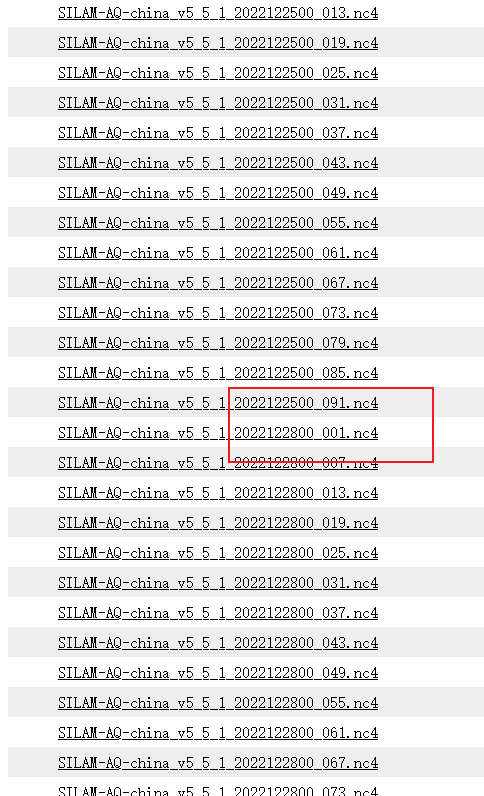

# 数据说明

数据下载地址  https://silam.fmi.fi/thredds/catalog/silam_china_v5_5_1/files/catalog.html

`数据说明` 对流层臭氧柱浓度数据，分层数据

这里使用第一层数据，即为近地面（10m）臭氧浓度

`单位` Dobson units(DU)

`时间` UTC时间

换算:  UTC时间 + 8 = 上海时间

分辨率  0.125*0.125

## 下载注意事项
12月26和27日数据没有，需要用25日预测数据代替。如下图所示
数据缺失情况：22.10.01-22.10.12

## 数据保存
### 1. 来自老师  
2.15-9.30
每天保存24小时的数据，数据时间为北京时间

### 自己下载
10.13-至今  需要处理，数据处理过程如下

# 代码处理

## 1. nc to tif  转换为tif

## 2. 重采样为0.01度 
1：
resample_silam.py， interpolation.py
使用插值手段GRA_Cubic,处理本人下载的数据

2： resample_processed.py

处理老师给的文件，这些文件也需要重采样

## 3. 裁剪  
tif_mosaic_clip.py

tif_clip_processed.py,处理processed数据
使用arcpy python2.7

## 4. 时间转换 
time_cycle.py

